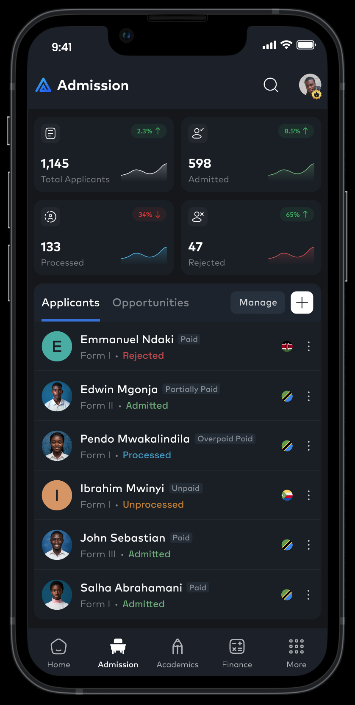

# aSoft Ltd

aSoft Ltd is a software development company that specializes in creating high-quality, scalable, and maintainable software solutions.
Our team of experienced developers is dedicated to delivering exceptional results for the users of our products.
We are committed to using the latest technologies and best practices to ensure that our software is reliable, efficient, and easy to use
and we pride ourselves on our attention to detail and our ability to work closely with our users to understand their needs and 
deliver best solutions that meet their requirements

## Take Home Assignment 
1. This assignment is meant to assess your skill set and see if you have what it takes to join the aSoft team
1. This assignment consists of two sections A and B
1. This assignment is not necessarily android specific (you can target other platforms i.e. desktop, ios, web)

### Section A: Basic Kotlin Skills
This is section is meant to test your kotlin skills so it does not need a UI.
A code block in simple main function should do the trick

1. Create a class called PetStore, and give it two suspending functions
  -  pets
  -  owners
2. Write a fake implementation of a Pet, give it a name and fake id
1. Write a fake implementation of an Owner, give it a name and a fake id 
1. The pets and owners function above should fake that they take exactly 1 second to return each of their results. (e.g. If it returns 3 pets, then it should take 3 seconds)
1. The pets and owners function should return a list of Pets and Owner as defined on (2) amd (3)
1. Write a program on your main function that fetches a list of pets and then a list of owners and matches each pet to a particular owner
1. Without changing the time of it takes to return each instance of (Pet) or (Owner), find a way to reduce the amount of time it takes to get the same results as requested on part 6

#### NOTE: 
- This question is intentionally vague to test your understanding. Do your best to not skip it but make approach it the way you understood it
- You are encouraged to use kotlin for this, but you lack skills there, use any strongly typed language

### Section B: Compose Skills
Using jetpack compose, create a user interface that looks like the image below.

#### NOTE:

- Using Compose Multiplatform will give you more bonus points, but you may also use Jetpack Compose
- If Jetpack Compose is a stretch, you may use any non web UI framework (i.e. react-native, flutter, swiftui, e.t.c) you are comfortable with
- Knowledge of declarative web frameworks (i.e. react, react-native-web, angular, vue, e.t.c) is an added advantage but won't be admissible in this assignment  

## Submission
- When finished, inform the HR that you are done, and a call will be scheduled with your submission